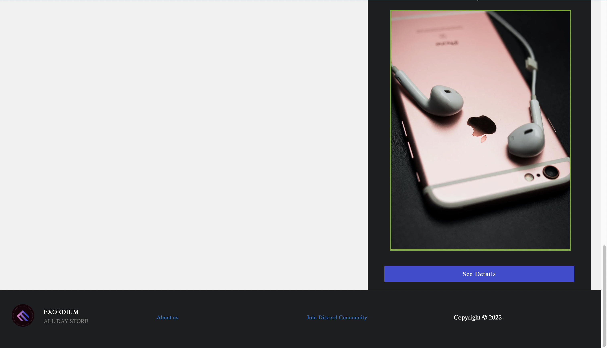
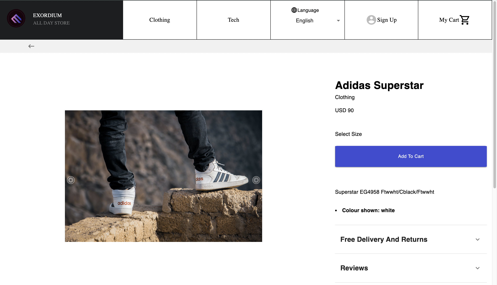
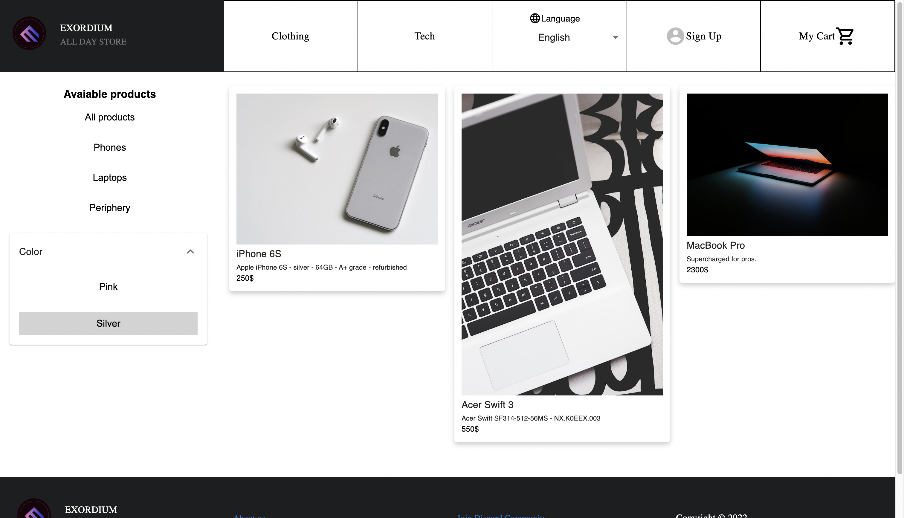
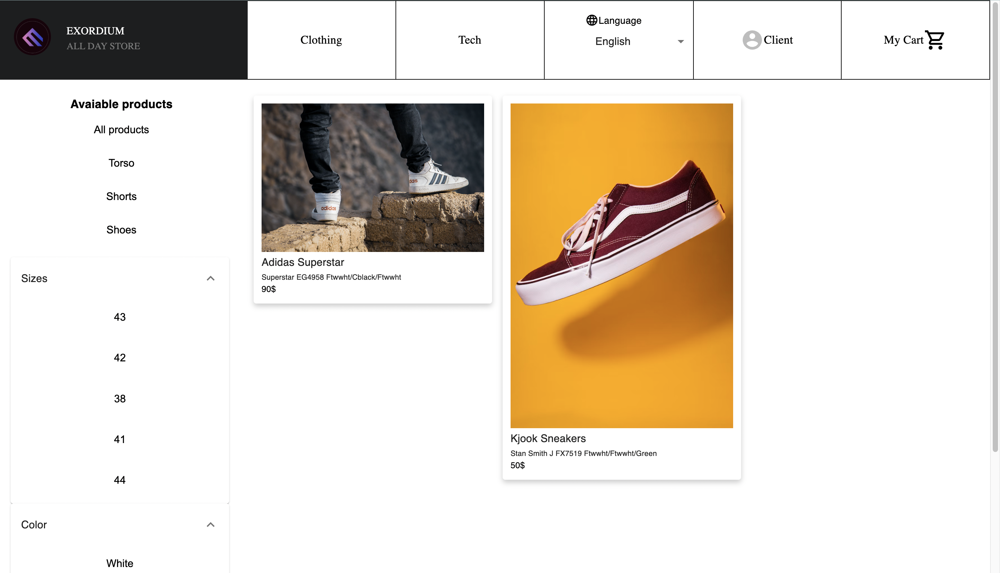
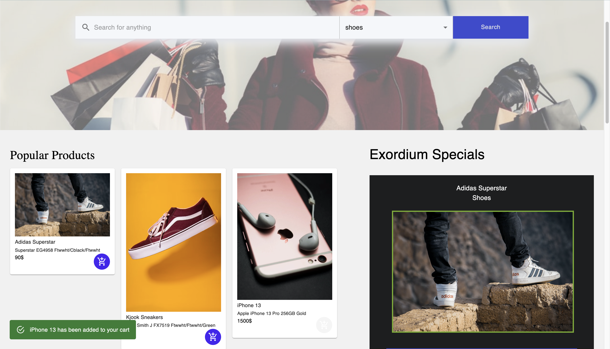
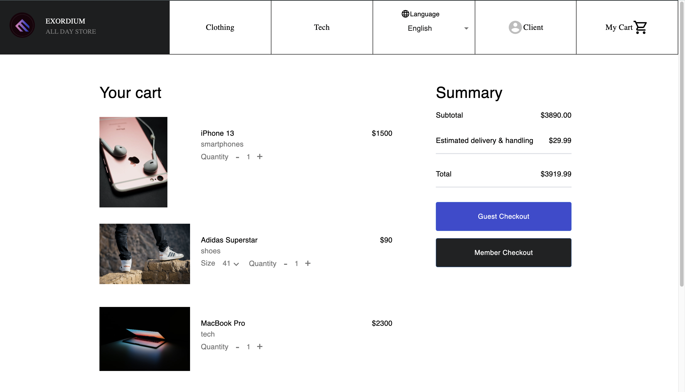
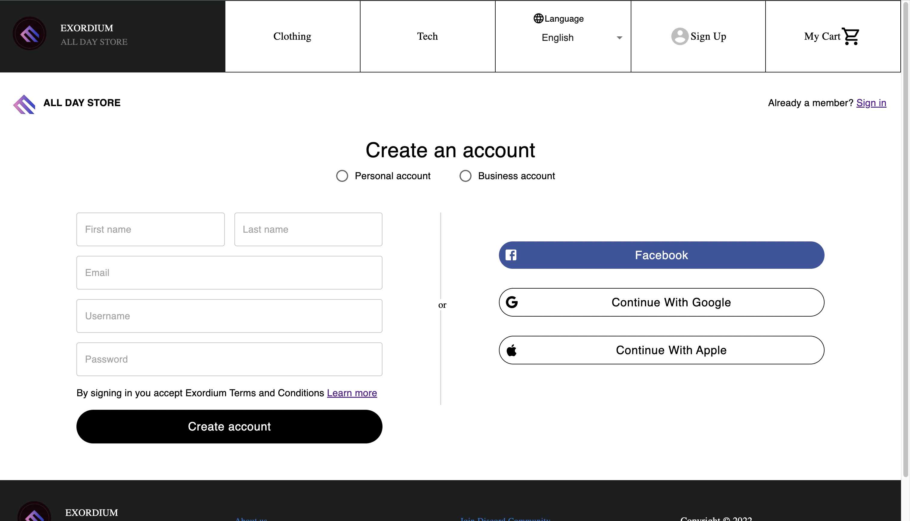
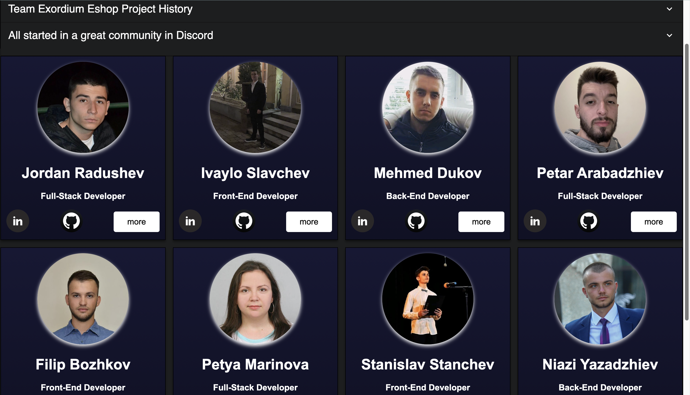

# Exordium E-shop
This is an all purpose e-shop practice project, maintain by a group of highly motivated young developers.

## Tech stack
The client app is a React 18 JavaScript project, using MUI React components. 

The server application is a Node JS application. ExpressJS framework.  
MySQL / Sequelize (Sequelize is a modern TypeScript and Node.js ORM for Oracle, Postgres, MySQL, MariaDB, SQLite and SQL Server, and more.) 

Database is loaded by Docker container locally.


## Local setup
```
1. Start the MySQL database containter with Docker locally    
1.1 folder /compose  docker-compose up -d
1.2 Run SQL script from /database folder
2. Create mock data
2.1 Open Postman
2.2 From hamburger menu in the top left corner
 "File -> import" select collection 
 folder database/mock_data_brands-types-products.postman_collection.json
2.3 In Postman right click on the loaded mock_data collection and click run collection
>The mock data should be now loaded to the database
3. Start the server application
3.1 Install dependencies folder /server -> npm install
3.2 Start server in development mode folder /server -> npm start
4. Start the client application
4.1 Install dependencies folder /client -> npm install
4.2 Start client in development mode folder /client -> npm start
```

## Demo screenshots of the e-shop project

#### Main page
 

#### Footer


#### Product Detail


#### Tech catalog


#### Clothing catalog


#### Add to cart action


#### Cart page


#### Sign up page


#### Sign in page


#### Team page

